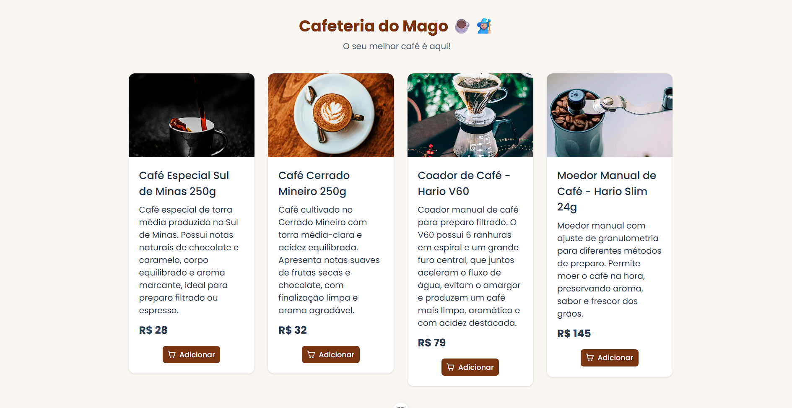
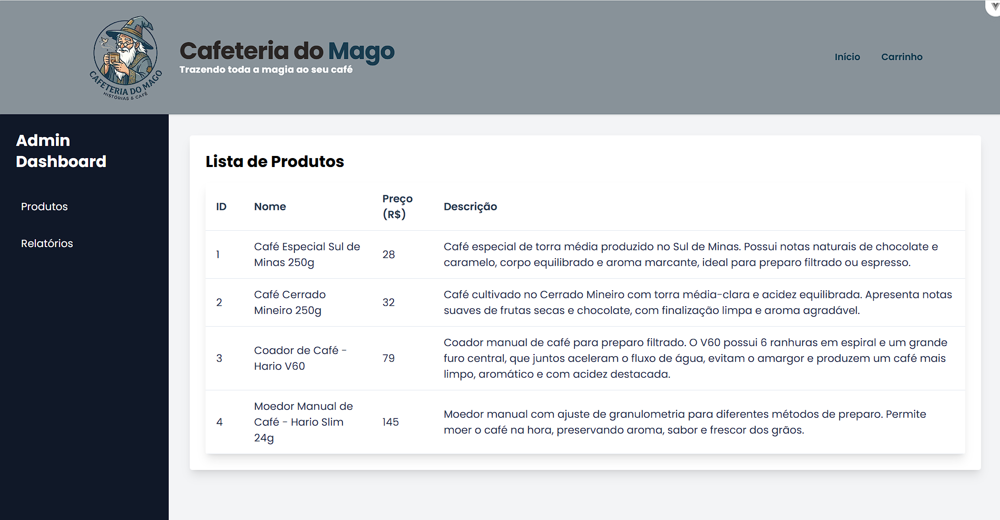
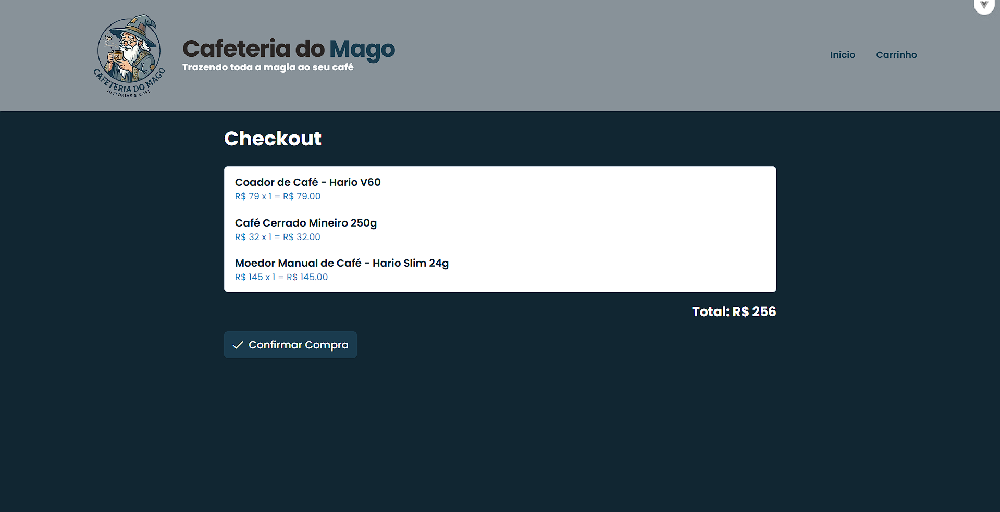

# Cafeteria do Mago ☕🧙🏼

Esse é um projeto de prática do programa TIC-12, feito para treinar Vue 3, PrimeVue e Tailwind CSS. 
A ideia foi criar uma pequena loja de café, onde você consegue ver produtos, adicionar ao carrinho e alterar quantidades.

